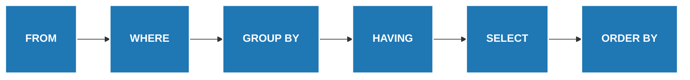

# SQL Execution Order Breakdown

This breakdown demonstrates how a SQL engine processes a query step-by-step, transforming a small dataset along the way.

**Our Example Query:**
```sql
SELECT region, SUM(amount) AS total_sales
FROM sales
WHERE product = 'Widget'
GROUP BY region
HAVING SUM(amount) > 100
ORDER BY total_sales DESC;
```



<br/>

````carousel
### Step 0: The Initial Dataset
Imagine we have the following `sales` table to start with:

| id | region | product | amount |
|---|---|---|---|
| 1 | North | Widget | 50 |
| 2 | North | Gadget | 80 |
| 3 | North | Widget | 70 |
| 4 | South | Widget | 40 |
| 5 | South | Widget | 30 |
| 6 | East  | Widget | 150|

<!-- slide -->
### Step 1: FROM
**Action:** The database identifies the source tables.
**Result:** The entire `sales` table is loaded into memory as the working set.

| id | region | product | amount |
|---|---|---|---|
| 1 | North | Widget | 50 |
| 2 | North | Gadget | 80 |
| 3 | North | Widget | 70 |
| 4 | South | Widget | 40 |
| 5 | South | Widget | 30 |
| 6 | East  | Widget | 150|

<!-- slide -->
### Step 2: WHERE
**Action:** `WHERE product = 'Widget'`
Rows that do not meet the condition are filtered out *before* any grouping happens. Notice how the 'Gadget' row is removed.

| id | region | product | amount |
|---|---|---|---|
| 1 | North | Widget | 50 |
| ~~2~~ | ~~North~~ | ~~Gadget~~ | ~~80~~ |
| 3 | North | Widget | 70 |
| 4 | South | Widget | 40 |
| 5 | South | Widget | 30 |
| 6 | East  | Widget | 150|

*Working Dataset moves forward without row 2.*

<!-- slide -->
### Step 3: GROUP BY
**Action:** `GROUP BY region`
The remaining data is partitioned into groups based on the unique values in the `region` column.

**North Group:**
| region | product | amount |
|---|---|---|
| North | Widget | 50, 70 |

**South Group:**
| region | product | amount |
|---|---|---|
| South | Widget | 40, 30 |

**East Group:**
| region | product | amount |
|---|---|---|
| East  | Widget | 150|

<!-- slide -->
### Step 4: HAVING
**Action:** `HAVING SUM(amount) > 100`
Filters the *groups* created in the previous step based on aggregate calculations.
*   **North:** 50 + 70 = 120 *(Keep)*
*   **South:** 40 + 30 = 70 *(Remove - not > 100)*
*   **East:** 150 = 150 *(Keep)*

*Working Dataset (Aggregated):*
| region | SUM(amount) |
|---|---|
| North | 120 |
| East  | 150 |

<!-- slide -->
### Step 5: SELECT
**Action:** `SELECT region, SUM(amount) AS total_sales`
The database evaluates the expressions in the SELECT clause, applies aliases, and formats the final columns to return.

| region | total_sales |
|---|---|
| North | 120 |
| East  | 150 |

<!-- slide -->
### Step 6: ORDER BY
**Action:** `ORDER BY total_sales DESC`
The final step sorts the result set. `East` has a higher `total_sales` (150) than `North` (120), so it moves to the top!

| region | total_sales |
|---|---|
| East  | 150 |
| North | 120 |

*(Sort applied, final result is ready to be returned to the user!)*
````
