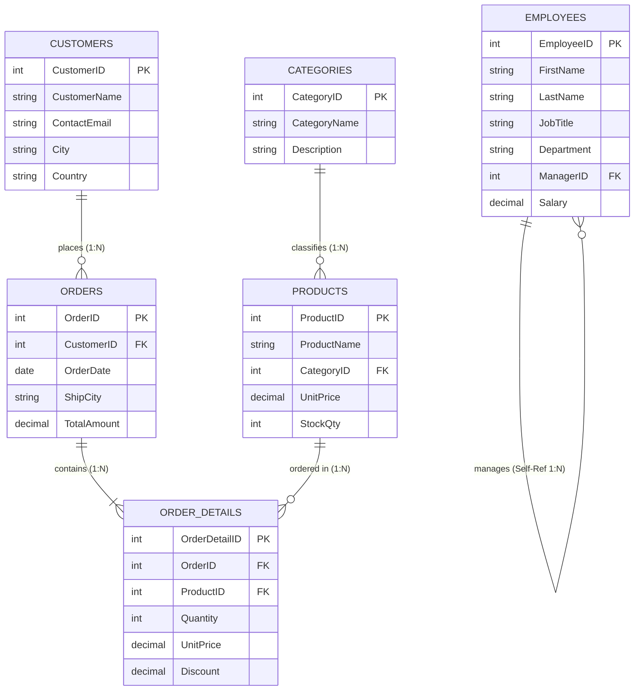

# Day 5 Hands-On Student Lab: Relational Joins & Schema Relationships

---

## Schema Architecture & Entity Relationship (ER) Diagram



> [!TIP]
> **Viewing in SQL Server Management Studio (SSMS):**
> Once you run the setup script below, you can visualize these relationships directly in SSMS:
> 1. Expand your database in **Object Explorer**.
> 2. Right-click **Database Diagrams** $\rightarrow$ select **New Database Diagram**.
> 3. Add all 6 tables (`Customers`, `Categories`, `Products`, `Orders`, `OrderDetails`, `Employees`).
> 4. SSMS will automatically render the visual relationship diagram with connector lines based on the explicit `FOREIGN KEY` constraints defined below.

---

## Setup Script (Run in SSMS):
```SQL
-- ============================================================================
-- Day 5: Combining Multiple Tables with JOINs in T-SQL
-- Setup Script: Creates relational schema with PRIMARY & FOREIGN KEY constraints
-- ============================================================================

-- Drop tables in child-to-parent order to respect foreign key constraints
IF OBJECT_ID('dbo.OrderDetails', 'U') IS NOT NULL DROP TABLE dbo.OrderDetails;
IF OBJECT_ID('dbo.Orders', 'U') IS NOT NULL DROP TABLE dbo.Orders;
IF OBJECT_ID('dbo.Products', 'U') IS NOT NULL DROP TABLE dbo.Products;
IF OBJECT_ID('dbo.Categories', 'U') IS NOT NULL DROP TABLE dbo.Categories;
IF OBJECT_ID('dbo.Customers', 'U') IS NOT NULL DROP TABLE dbo.Customers;
IF OBJECT_ID('dbo.Employees', 'U') IS NOT NULL DROP TABLE dbo.Employees;

-- 1. Customers Table (Parent Table)
CREATE TABLE dbo.Customers (
    CustomerID INT CONSTRAINT PK_Customers PRIMARY KEY,
    CustomerName VARCHAR(100) NOT NULL,
    ContactEmail VARCHAR(100),
    City VARCHAR(50),
    Country VARCHAR(50)
);

-- 2. Categories Table (Parent Table)
CREATE TABLE dbo.Categories (
    CategoryID INT CONSTRAINT PK_Categories PRIMARY KEY,
    CategoryName VARCHAR(50) NOT NULL,
    Description VARCHAR(200)
);

-- 3. Products Table (Child of Categories)
CREATE TABLE dbo.Products (
    ProductID INT CONSTRAINT PK_Products PRIMARY KEY,
    ProductName VARCHAR(100) NOT NULL,
    CategoryID INT NULL,
    UnitPrice DECIMAL(10, 2) NOT NULL,
    StockQty INT NOT NULL,
    CONSTRAINT FK_Products_Categories FOREIGN KEY (CategoryID) 
        REFERENCES dbo.Categories(CategoryID)
);

-- 4. Orders Table (Child of Customers)
CREATE TABLE dbo.Orders (
    OrderID INT CONSTRAINT PK_Orders PRIMARY KEY,
    CustomerID INT NULL,
    OrderDate DATE NOT NULL,
    ShipCity VARCHAR(50),
    TotalAmount DECIMAL(10, 2),
    CONSTRAINT FK_Orders_Customers FOREIGN KEY (CustomerID) 
        REFERENCES dbo.Customers(CustomerID)
);

-- 5. OrderDetails Table (Bridge / Child of Orders & Products)
CREATE TABLE dbo.OrderDetails (
    OrderDetailID INT CONSTRAINT PK_OrderDetails PRIMARY KEY,
    OrderID INT NOT NULL,
    ProductID INT NOT NULL,
    Quantity INT NOT NULL,
    UnitPrice DECIMAL(10, 2) NOT NULL,
    Discount DECIMAL(4, 2) DEFAULT 0.00,
    CONSTRAINT FK_OrderDetails_Orders FOREIGN KEY (OrderID) 
        REFERENCES dbo.Orders(OrderID),
    CONSTRAINT FK_OrderDetails_Products FOREIGN KEY (ProductID) 
        REFERENCES dbo.Products(ProductID)
);

-- 6. Employees Table (Self-Referencing Parent/Child Hierarchy)
CREATE TABLE dbo.Employees (
    EmployeeID INT CONSTRAINT PK_Employees PRIMARY KEY,
    FirstName VARCHAR(50) NOT NULL,
    LastName VARCHAR(50) NOT NULL,
    JobTitle VARCHAR(100) NOT NULL,
    Department VARCHAR(50),
    ManagerID INT NULL,
    Salary DECIMAL(10, 2),
    CONSTRAINT FK_Employees_Manager FOREIGN KEY (ManagerID) 
        REFERENCES dbo.Employees(EmployeeID)
);

-- ============================================================================
-- Populate Sample Data
-- ============================================================================

-- Customers (Note: Customer 105 and 106 have NO orders)
INSERT INTO dbo.Customers VALUES
(101, 'Acme Corp', 'contact@acme.com', 'Toronto', 'Canada'),
(102, 'Global Logistics', 'support@globallog.com', 'Vancouver', 'Canada'),
(103, 'Apex Solutions', 'info@apexsolutions.com', 'New York', 'USA'),
(104, 'Blue Horizon Media', 'hello@bluehorizon.com', 'Seattle', 'USA'),
(105, 'Starlight Retail', 'admin@starlight.com', 'Chicago', 'USA'),
(106, 'Nordic Ventures', 'trade@nordic.com', 'Toronto', 'Canada');

-- Categories (Note: Category 5 has NO products)
INSERT INTO dbo.Categories VALUES
(1, 'Electronics', 'Phones, laptops, accessories, and audio'),
(2, 'Office Supplies', 'Paper, pens, desk equipment, and binders'),
(3, 'Furniture', 'Ergonomic chairs, standing desks, lamps'),
(4, 'Software', 'Cloud licenses, developer tools, and OS'),
(5, 'Industrial Goods', 'Heavy machinery, tools, safety equipment');

-- Products (Note: Product 206 has NO category, Product 207 has NO orders)
INSERT INTO dbo.Products VALUES
(201, '4K Ultra Monitor', 1, 399.99, 45),
(202, 'Ergonomic Mesh Chair', 3, 249.50, 20),
(203, 'Wireless Mechanical Keyboard', 1, 119.00, 80),
(204, 'Executive Standing Desk', 3, 599.00, 15),
(205, 'LaserJet Multi-Function Printer', 2, 289.00, 30),
(206, 'Custom Client Gift Set', NULL, 75.00, 50),
(207, 'Noise-Canceling Pro Headset', 1, 199.99, 60);

-- Orders (Note: Order 1006 has NULL CustomerID)
INSERT INTO dbo.Orders VALUES
(1001, 101, '2024-01-10', 'Toronto', 918.99),
(1002, 102, '2024-01-14', 'Vancouver', 119.00),
(1003, 101, '2024-01-20', 'Toronto', 1198.00),
(1004, 103, '2024-02-01', 'New York', 249.50),
(1005, 104, '2024-02-15', 'Seattle', 674.00),
(1006, NULL, '2024-02-18', 'Miami', 399.99);

-- OrderDetails
INSERT INTO dbo.OrderDetails VALUES
(1, 1001, 201, 2, 399.99, 0.00),
(2, 1001, 203, 1, 119.00, 0.00),
(3, 1002, 203, 1, 119.00, 0.00),
(4, 1003, 204, 2, 599.00, 0.00),
(5, 1004, 202, 1, 249.50, 0.00),
(6, 1005, 201, 1, 399.99, 0.05),
(7, 1005, 205, 1, 289.00, 0.00),
(8, 1006, 201, 1, 399.99, 0.00);

-- Employees (Hierarchical organizational chart)
INSERT INTO dbo.Employees VALUES
(1, 'Sophia', 'Vance', 'Chief Executive Officer', 'Executive', NULL, 185000.00),
(2, 'Marcus', 'Reed', 'VP of Engineering', 'Engineering', 1, 140000.00),
(3, 'Elena', 'Rostova', 'VP of Sales', 'Sales', 1, 135000.00),
(4, 'Liam', 'Chen', 'Lead Software Engineer', 'Engineering', 2, 110000.00),
(5, 'Olivia', 'Davis', 'Senior QA Engineer', 'Engineering', 2, 95000.00),
(6, 'Noah', 'Patel', 'Senior Account Executive', 'Sales', 3, 90000.00),
(7, 'Emma', 'Wilson', 'Sales Associate', 'Sales', 6, 62000.00),
(8, 'Lucas', 'Taylor', 'Junior Developer', 'Engineering', 4, 72000.00);
```

---

## Student Tasks:

### Task 1 (Basic Two-Table INNER JOIN):
Write a query to retrieve all orders placed by registered customers:
- Select `CustomerID` and `CustomerName` from `dbo.Customers`.
- Select `OrderID`, `OrderDate`, and `TotalAmount` from `dbo.Orders`.
- Use an `INNER JOIN` matching on `CustomerID`.
- Sort by `OrderDate` descending.

### Task 2 (Multi-Table INNER JOIN — Chaining 4 Tables):
Write a query to build a comprehensive line-item sales report:
- Display `CustomerName`, `OrderID`, `OrderDate`, `ProductName`, `Quantity`, `UnitPrice` (from `OrderDetails`), and calculate line item total as `[LineTotal]` (`Quantity * UnitPrice * (1 - Discount)`).
- Join `dbo.Customers`, `dbo.Orders`, `dbo.OrderDetails`, and `dbo.Products`.
- Sort by `OrderID` ascending, then `LineTotal` descending.

### Task 3 (LEFT OUTER JOIN):
Write a query to inspect customer purchase activity:
- Display `CustomerID`, `CustomerName`, and `City` from `dbo.Customers`.
- Display `OrderID` and `TotalAmount` from `dbo.Orders`.
- Ensure **all** customers appear in the output, even if they have not placed any orders.
- Sort by `TotalAmount` descending.

### Task 4 (Anti-Join — Identifying Inactive Records with `IS NULL`):
Write two separate queries to find orphan / unused records:
1. **Query 4A**: Find all customers who have **never placed an order**. Display `CustomerID`, `CustomerName`, `ContactEmail`, and `City`.
2. **Query 4B**: Find all products that have **never been ordered**. Display `ProductID`, `ProductName`, and `UnitPrice`.

### Task 5 (RIGHT OUTER JOIN):
Write a query to list all product categories and their associated products:
- Display `CategoryName` from `dbo.Categories` and `ProductName`, `UnitPrice` from `dbo.Products`.
- Use a `RIGHT OUTER JOIN` starting with `dbo.Products` on the left and `dbo.Categories` on the right (or vice versa with `LEFT JOIN`) so that categories with **no products** (such as `'Industrial Goods'`) are still included in the result.
- Sort by `CategoryName` ascending.

### Task 6 (FULL OUTER JOIN):
Write a query to analyze the relationship between `dbo.Customers` and `dbo.Orders`:
- Display `c.CustomerID` as `[Cust_CustomerID]`, `c.CustomerName`, `o.OrderID`, `o.CustomerID` as `[Order_CustomerID]`, and `o.TotalAmount`.
- Use a `FULL OUTER JOIN` to return:
  - Customers with matching orders.
  - Customers with no orders (e.g. Acme Corp vs. Starlight Retail).
  - Orders with no assigned customer (e.g. Order 1006).

### Task 7 (CROSS JOIN — Matrix / Combination Generation):
The marketing team wants to evaluate regional demand for product categories:
- Generate a Cartesian product combining all distinct customer `City` values from `dbo.Customers` with all `CategoryName` values from `dbo.Categories`.
- Display `City` and `CategoryName`.
- Sort by `City` ascending, then `CategoryName` ascending.

### Task 8 (Self Join — Hierarchical Reporting Structure):
Write a query to display the employee organizational hierarchy:
- Display employee's full name as `[Employee Name]`, `JobTitle` as `[Employee Title]`, and `Department`.
- Display their manager's full name as `[Manager Name]` and `JobTitle` as `[Manager Title]`.
- Use a `LEFT JOIN` on `dbo.Employees` so that the CEO (who has `ManagerID IS NULL`) is included, displaying `'Top Executive'` if the manager name is NULL using `ISNULL()`.
- Sort by `Department`, then `[Employee Name]`.

### Task 9 (Self Join — Intra-Table Comparison):
Find all pairs of distinct customers located in the same city:
- Display `City`, `c1.CustomerName` as `[Customer 1]`, and `c2.CustomerName` as `[Customer 2]`.
- Ensure a customer is not paired with themselves and avoid duplicate mirror pairs (e.g., only show `(Acme Corp, Nordic Ventures)`, not both `(Acme, Nordic)` and `(Nordic, Acme)`).

### Task 10 (Advanced Multi-Table Join with Aggregation):
Write a query to compute overall sales summary metrics per customer:
- Display `c.CustomerID`, `c.CustomerName`, total number of orders placed as `[Total Orders]`, and total revenue generated as `[Total Spent]`.
- Include customers with zero orders (showing `0` for orders and `0.00` for total spent using `COUNT(o.OrderID)` and `ISNULL(SUM(o.TotalAmount), 0.00)`).
- Filter using `HAVING` to show only customers who have placed at least 1 order or sort all customers by `[Total Spent]` descending.

---

