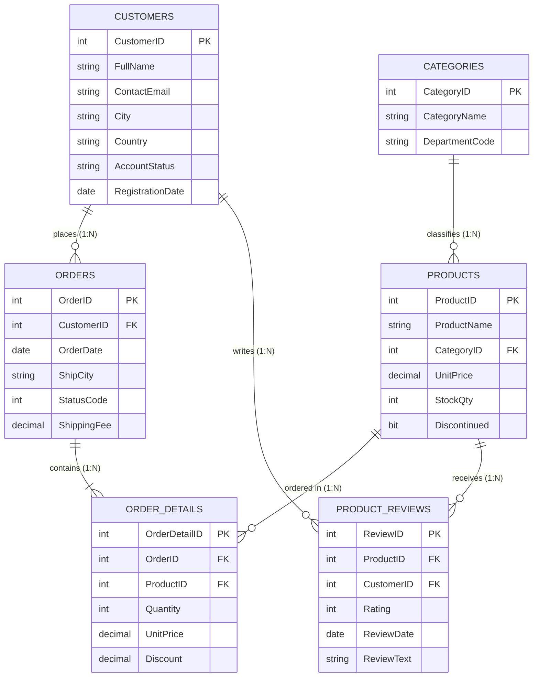

# Day 6 Hands-On Student Lab: Subqueries & Built-In Transact-SQL Functions

---

## Schema Architecture & Entity Relationship (ER) Diagram



> [!TIP]
> **SSMS Visual Relationship Diagram:**
> Run the setup script below in SQL Server Management Studio (SSMS). You can right-click **Database Diagrams** $\rightarrow$ **New Database Diagram** and add all 6 tables to view the foreign key relationship graph.

---

## Setup Script (Run in SSMS)

```SQL
-- ============================================================================
-- Day 6: Subqueries & Built-In Functions in T-SQL
-- Setup Script: Creates schema with PRIMARY & FOREIGN KEY constraints + Sample Data
-- ============================================================================

-- Drop tables in child-to-parent order to respect relational constraints
IF OBJECT_ID('dbo.ProductReviews', 'U') IS NOT NULL DROP TABLE dbo.ProductReviews;
IF OBJECT_ID('dbo.OrderDetails', 'U')   IS NOT NULL DROP TABLE dbo.OrderDetails;
IF OBJECT_ID('dbo.Orders', 'U')         IS NOT NULL DROP TABLE dbo.Orders;
IF OBJECT_ID('dbo.Products', 'U')       IS NOT NULL DROP TABLE dbo.Products;
IF OBJECT_ID('dbo.Categories', 'U')     IS NOT NULL DROP TABLE dbo.Categories;
IF OBJECT_ID('dbo.Customers', 'U')      IS NOT NULL DROP TABLE dbo.Customers;

-- 1. Customers Table
CREATE TABLE dbo.Customers (
    CustomerID INT CONSTRAINT PK_Customers PRIMARY KEY,
    FullName VARCHAR(100) NOT NULL,
    ContactEmail VARCHAR(100) NULL,
    City VARCHAR(50) NOT NULL,
    Country VARCHAR(50) NOT NULL,
    AccountStatus VARCHAR(20) NOT NULL DEFAULT 'Active',
    RegistrationDate DATE NOT NULL
);

-- 2. Categories Table
CREATE TABLE dbo.Categories (
    CategoryID INT CONSTRAINT PK_Categories PRIMARY KEY,
    CategoryName VARCHAR(50) NOT NULL,
    DepartmentCode VARCHAR(10) NOT NULL
);

-- 3. Products Table
CREATE TABLE dbo.Products (
    ProductID INT CONSTRAINT PK_Products PRIMARY KEY,
    ProductName VARCHAR(100) NOT NULL,
    CategoryID INT NULL CONSTRAINT FK_Products_Categories REFERENCES dbo.Categories(CategoryID),
    UnitPrice DECIMAL(10, 2) NOT NULL,
    StockQty INT NOT NULL DEFAULT 0,
    Discontinued BIT NOT NULL DEFAULT 0
);

-- 4. Orders Table
CREATE TABLE dbo.Orders (
    OrderID INT CONSTRAINT PK_Orders PRIMARY KEY,
    CustomerID INT NULL CONSTRAINT FK_Orders_Customers REFERENCES dbo.Customers(CustomerID),
    OrderDate DATE NOT NULL,
    ShipCity VARCHAR(50) NOT NULL,
    StatusCode INT NOT NULL, -- 1: Pending, 2: Processing, 3: Shipped, 4: Delivered
    ShippingFee DECIMAL(10, 2) NOT NULL DEFAULT 0.00
);

-- 5. Order Details Table
CREATE TABLE dbo.OrderDetails (
    OrderDetailID INT CONSTRAINT PK_OrderDetails PRIMARY KEY,
    OrderID INT NOT NULL CONSTRAINT FK_OrderDetails_Orders REFERENCES dbo.Orders(OrderID),
    ProductID INT NOT NULL CONSTRAINT FK_OrderDetails_Products REFERENCES dbo.Products(ProductID),
    Quantity INT NOT NULL CHECK (Quantity > 0),
    UnitPrice DECIMAL(10, 2) NOT NULL,
    Discount DECIMAL(4, 2) NOT NULL DEFAULT 0.00
);

-- 6. Product Reviews Table
CREATE TABLE dbo.ProductReviews (
    ReviewID INT CONSTRAINT PK_ProductReviews PRIMARY KEY,
    ProductID INT NOT NULL CONSTRAINT FK_ProductReviews_Products REFERENCES dbo.Products(ProductID),
    CustomerID INT NOT NULL CONSTRAINT FK_ProductReviews_Customers REFERENCES dbo.Customers(CustomerID),
    Rating INT NOT NULL CHECK (Rating BETWEEN 1 AND 5),
    ReviewDate DATE NOT NULL,
    ReviewText VARCHAR(255) NULL
);

-- ============================================================================
-- Populate Sample Data
-- ============================================================================

-- Customers
INSERT INTO dbo.Customers VALUES
(1, 'Alice Morgan', 'alice.morgan@techcorp.com', 'Toronto', 'Canada', 'Active', '2022-03-15'),
(2, 'Bob Chen', 'bob_chen@logistics.ca', 'Vancouver', 'Canada', 'Active', '2022-07-22'),
(3, 'Catherine Vance', 'catherine.v@nyenterprise.com', 'New York', 'USA', 'Active', '2023-01-10'),
(4, 'David Ross', 'david.ross@austinretail.com', 'Austin', 'USA', 'Inactive', '2023-05-18'),
(5, 'Elena Rostova', 'elena.rostova@seattlesoft.com', 'Seattle', 'USA', 'Active', '2023-09-01'),
(6, 'Franklin Wright', NULL, 'Toronto', 'Canada', 'Active', '2023-11-20'),
(7, 'Grace Hopper', 'grace.hopper@calc.org', 'Boston', 'USA', 'Active', '2024-01-05');

-- Categories
INSERT INTO dbo.Categories VALUES
(10, 'Electronics & Gadgets', 'TECH'),
(20, 'Office Furniture', 'FURN'),
(30, 'Computer Accessories', 'ACC'),
(40, 'Specialty Stationery', 'STAT');

-- Products
INSERT INTO dbo.Products VALUES
(101, '4K Ultra Gaming Monitor', 10, 499.99, 25, 0),
(102, 'Ergonomic Executive Mesh Chair', 20, 299.50, 15, 0),
(103, 'Wireless Mechanical Keyboard', 30, 129.00, 50, 0),
(104, 'Height Adjustable Standing Desk', 20, 599.00, 8, 0),
(105, 'Noise-Canceling Pro Headset', 10, 199.99, 40, 0),
(106, 'Laser Precision Mouse', 30, 49.99, 85, 0),
(107, 'Smart LED Desk Lamp', 20, 79.99, 30, 0),
(108, 'Executive Leather Notebook Set', 40, 34.50, 60, 0),
(109, 'Legacy Serial Cable Adapter', NULL, 15.00, 0, 1);

-- Orders (Note: Order 1007 has NULL CustomerID to test 3-valued logic)
INSERT INTO dbo.Orders VALUES
(1001, 1, '2024-01-15', 'Toronto', 4, 15.00),
(1002, 2, '2024-01-20', 'Vancouver', 4, 0.00),
(1003, 1, '2024-02-05', 'Toronto', 4, 10.00),
(1004, 3, '2024-02-14', 'New York', 3, 25.00),
(1005, 5, '2024-02-28', 'Seattle', 2, 12.50),
(1006, 1, '2024-03-02', 'Toronto', 1, 0.00),
(1007, NULL, '2024-03-05', 'Montreal', 1, 20.00);

-- Order Details
INSERT INTO dbo.OrderDetails VALUES
(1, 1001, 101, 1, 499.99, 0.00),
(2, 1001, 103, 1, 129.00, 0.05),
(3, 1002, 106, 2, 49.99, 0.00),
(4, 1003, 104, 1, 599.00, 0.10),
(5, 1004, 102, 2, 299.50, 0.00),
(6, 1004, 105, 1, 199.99, 0.00),
(7, 1005, 101, 1, 499.99, 0.00),
(8, 1005, 107, 2, 79.99, 0.00),
(9, 1006, 108, 3, 34.50, 0.00),
(10, 1007, 103, 1, 129.00, 0.00);

-- Product Reviews
INSERT INTO dbo.ProductReviews VALUES
(1, 101, 1, 5, '2024-01-25', 'Exceptional color accuracy and ultra fast refresh rate!'),
(2, 103, 1, 4, '2024-01-26', 'Great tactile feel, clicky switches are satisfying.'),
(3, 106, 2, 5, '2024-01-28', 'Ergonomic shape prevents wrist strain during long sessions.'),
(4, 104, 1, 5, '2024-02-12', 'Smooth motorized transition, rock-solid stability.'),
(5, 102, 3, 3, '2024-02-20', 'Decent lumbar support but armrests could be softer.'),
(6, 105, 3, 5, '2024-02-22', 'Active noise cancellation completely isolates background chatter.'),
(7, 101, 5, 4, '2024-03-05', 'High quality panel, HDR is bright and crisp.');
```

---

## Student Tasks

### Task 1: Scalar Subquery in the `WHERE` Clause

Write a query to identify high-priced catalog items:

- Select `ProductID`, `ProductName`, and `UnitPrice` from `dbo.Products`.
- Filter only products whose `UnitPrice` is **strictly greater than the overall average unit price** across all products in the table.
- Order by `UnitPrice` in descending order.

---

### Task 2: Scalar Subquery in the `SELECT` List (Benchmarking Metrics)

Write a query to benchmark each product against the catalog ceiling:

- Select `ProductID`, `ProductName`, and `UnitPrice`.
- Add a calculated column named `[MaxCatalogPrice]` using a scalar subquery that computes the highest unit price across `dbo.Products`.
- Add a calculated column named `[PriceDifferenceFromMax]` that computes `[MaxCatalogPrice] - UnitPrice`.
- Sort by `PriceDifferenceFromMax` ascending.

---

### Task 3: Multi-Valued Subquery with `IN`

Write a query to find all registered customers who have placed at least one high-value order containing any single item priced at or above `$400.00`:

- Display `CustomerID`, `FullName`, `City`, and `Country` from `dbo.Customers`.
- Filter rows using `CustomerID IN (...)` with an inner query on `dbo.Orders` joined with `dbo.OrderDetails` where `UnitPrice >= 400.00`.
- Sort by `FullName` ascending.

---

### Task 4: The `NOT IN` vs. `NOT EXISTS` Anti-Join Challenge

Find all customers who have **never placed any order**:

1. First, observe why a basic `WHERE CustomerID NOT IN (SELECT CustomerID FROM dbo.Orders)` fails to return all expected rows due to `Order 1007` having `CustomerID = NULL`.
2. Write a safe query using `NOT EXISTS` to return `CustomerID`, `FullName`, `City`, and `ContactEmail` for customers with zero purchase history.

---

### Task 5: Correlated Subquery (Finding the Most Recent Order per Customer)

Write a query to retrieve each customer's most recent order record:

- Select `CustomerID`, `OrderID`, `OrderDate`, and `ShipCity` from `dbo.Orders` aliased as `o1`.
- Use a correlated subquery in the `WHERE` clause comparing `o1.OrderDate` to the `MAX(o2.OrderDate)` for the same `CustomerID`.
- Sort by `CustomerID` ascending.

---

### Task 6: Correlated Subquery with `EXISTS`

Write a query to find all categories that currently offer at least one product with **more than 20 units in stock**:

- Select `CategoryID` and `CategoryName` from `dbo.Categories` aliased as `c`.
- Use `WHERE EXISTS` with an inner query referencing `dbo.Products` aliased as `p`, matching `p.CategoryID = c.CategoryID` and `p.StockQty > 20`.
- Order by `CategoryName` ascending.

---

### Task 7: String & Date/Time Built-In Scalar Functions

Produce a customer intelligence report:

- Display `FullName`.
- Display the customer's email domain name as `[EmailDomain]` by extracting the substring after the `@` symbol using `CHARINDEX()` and `SUBSTRING()`. (If `ContactEmail` is `NULL`, return `'NO_EMAIL'`).
- Display the customer's registration year as `[RegYear]` using `YEAR()`.
- Display the customer's tenure in days as `[TenureDays]` using `DATEDIFF(day, RegistrationDate, GETDATE())`.
- Order by `TenureDays` descending.

---

### Task 8: Data Type Conversion & Safe Casting (`TRY_CONVERT` & `FORMAT`)

Format order metadata for reporting:

- Select `OrderID` and `OrderDate`.
- Convert `OrderDate` to US Standard format (`mm/dd/yyyy`) using `CONVERT(VARCHAR(10), OrderDate, 101)` as `[US_OrderDate]`.
- Convert `OrderDate` to ISO Standard format (`yyyy-mm-dd`) using `CONVERT(VARCHAR(10), OrderDate, 120)` as `[ISO_OrderDate]`.
- Use `TRY_CONVERT(INT, ShipCity)` as `[SafeCityAsInt]` to demonstrate how invalid data conversions safely yield `NULL` without terminating query execution.

---

### Task 9: Inline Logical Functions (`IIF`, `CHOOSE`, `COALESCE`)

Write a query to normalize and classify orders:

- Display `OrderID`, `OrderDate`, and `ShippingFee`.
- Use `IIF()` to output `[ShippingClassification]`: `'Free Shipping'` if `ShippingFee = 0.00`, otherwise `'Standard Shipping'`.
- Use `CHOOSE()` on `StatusCode` to return `[OrderStatusDescription]` with values `'Pending'`, `'Processing'`, `'Shipped'`, `'Delivered'`.
- Use `COALESCE()` on `CustomerID` to display `[CustomerAccountID]` (if `CustomerID` is `NULL`, output `-1`).
- Sort by `OrderID` ascending.

---

### Task 10: Ranking Functions with `OVER(PARTITION BY ... ORDER BY ...)`

Compare ranking behaviors across product categories:

- Select `CategoryID`, `ProductName`, and `UnitPrice` from `dbo.Products`.
- Filter out discontinued items (`Discontinued = 0`) and items with `CategoryID IS NOT NULL`.
- Calculate `ROW_NUMBER() OVER(PARTITION BY CategoryID ORDER BY UnitPrice DESC)` as `[RowNumber]`.
- Calculate `RANK() OVER(PARTITION BY CategoryID ORDER BY UnitPrice DESC)` as `[Rank]`.
- Calculate `DENSE_RANK() OVER(PARTITION BY CategoryID ORDER BY UnitPrice DESC)` as `[DenseRank]`.
- Calculate `NTILE(2) OVER(PARTITION BY CategoryID ORDER BY UnitPrice DESC)` as `[PriceTier]`.
- Order by `CategoryID` ascending, `UnitPrice` descending.

---

### Task 11: Derived Table Subquery with Ranking (Top N per Category)

Write a query to return only the **Top 1 highest-priced product** for each category:

- Build a derived table (subquery in `FROM`) that computes `DENSE_RANK()` partitioned by `CategoryID` ordered by `UnitPrice DESC`.
- Join the derived table with `dbo.Categories` to display `CategoryName`, `ProductName`, and `UnitPrice`.
- Filter in the outer `WHERE` clause for `DenseRank = 1`.

---

### Task 12: Advanced Aggregations with `STRING_AGG` & `HAVING`

Generate an order packing manifest for all multi-item orders:

- Display `o.OrderID`, `o.OrderDate`, `COUNT(od.OrderDetailID)` AS `[TotalDistinctItems]`, and `SUM(od.Quantity)` AS `[TotalUnitCount]`.
- Use `STRING_AGG(p.ProductName, ' | ')` to create a single concatenated list of product names named `[ManifestSummary]`.
- Join `dbo.Orders`, `dbo.OrderDetails`, and `dbo.Products`.
- Group by `o.OrderID` and `o.OrderDate`.
- Use `HAVING` to include only orders that have **2 or more distinct line items**.
- Sort by `TotalUnitCount` descending.

---

## Lab Solutions (Check Your Work)

```SQL
-- ============================================================================
-- Day 6 Lab Solutions
-- ============================================================================

-- Task 1
```
